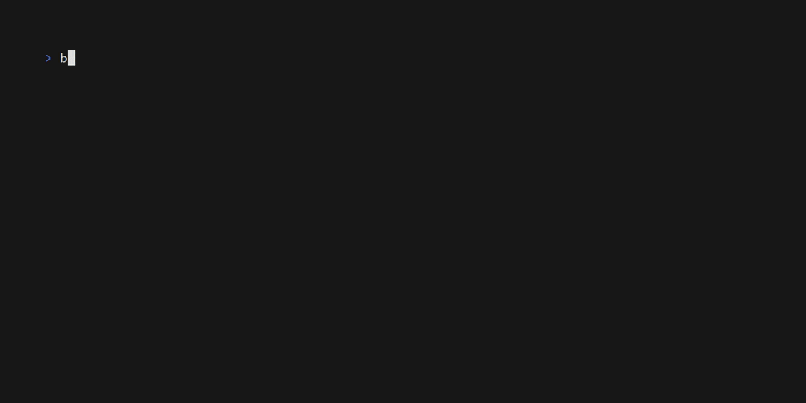

<div align="center">


</div>

# Bob

> Struggle to keep your Neovim versions in check? Bob provides an easy way to install and switch versions on any system!

Bob is a cross-platform and easy-to-use Neovim version manager, allowing for easy switching between versions right from the command line.

## 🌟 Showcase



## 🔔 Notices

- **2022-10-29**: Moved bob's symbolic link and downloads folder on macos from `/Users/user/Library/Application Support` to `~/.local/share` please make sure to move all of your downloads to the new folder, run `bob use <your desired version>` and update your PATH
- **2023-02-13**: Bob has recently switched to using a proxy executable for running Neovim executables. To switch from the old method that Bob used, follow these steps:

    1. Remove the current Neovim path from your global $PATH environment variable.
    2. Delete the following directory:
        On Unix: `~/.local/share/neovim`
        On Windows: `C:\Users\<username>\AppData\Local\neovim`

    Secondly the name of the downloads directory property in the configuration file has changed. Please refer to the updated list of properties for the new name.
- **2024-03-04**: Due to Neovim's recent MacOS binary changes, bob now supports arm completely, but unfortunately, it comes with some breaking changes specifically for bob's proxy executable. To fix that, follow these steps (which will not be necessary soon):

  1. Remove `nvim` binary from `nvim-bin` which is located in the same directory the same as the neovim binaries downloads folder.
  2. Copy your newly downloaded bob binary and put the copy inside of `nvim-bin`
  3. Rename your bob binary inside `nvim-bin` to `nvim`.

- **2024-05-17**: Support for `nvim-qt` is now deprecated as Neovim no longer supports it in newer releases. If you're currently using `nvim-qt`, we recommend switching to a different Neovim GUI or using Neovim in the terminal. Please refer to the Neovim documentation for more information on supported GUIs.
- **2024-05-19**: Important notice for users who built Neovim from source using a commit hash before the newest Bob version: Due to recent changes in Bob, these versions will need to be rebuilt. Alternatively, you can manually add a file named `full-hash.txt` at the root of the directory. This file should contain the full hash of the commit used to build Neovim. This change ensures better tracking and management of versions built from source. We apologize for any inconvenience and appreciate your understanding.

## 📦 Requirements

Make sure you don't have Neovim already installed via other ways e.g. a package manager.

#### Building bob

Make sure [rustup](https://www.rust-lang.org/tools/install) is installed.

(Optional) `openssl` if built with `native-tls` feature.

#### Building Neovim

For further information refer to the [Neovim wiki](https://github.com/neovim/neovim/wiki/Building-Neovim#build-prerequisites).

<details>
<summary>All platforms</summary>

- CMake
- Git

</details>

<details>
<summary>Windows</summary>

- [Visual Studio Build Tools](https://visualstudio.microsoft.com/visual-cpp-build-tools/) with C++ extension pack

</details>

<details>
<summary>Unix</summary>

- Clang or GCC

**MacOS note**: [follow these instructions](https://github.com/neovim/neovim/wiki/Building-Neovim#macos--homebrew)

</details>

## 🔧 Installation

### Install from releases

1. Download the bob release suitable for your platform: either `bob-{platform}-x86_64.zip` for the standard version or `bob-{platform}-x86_64-openssl.zip` for the OpenSSL version.
2. Unzip it
3. Run it with `bob`

### Install with pacman

1. On Arch Linux, you can install `bob` from the [extra repository](https://archlinux.org/packages/extra/x86_64/bob/) using pacman: `pacman -S bob`
2. Run it with `bob`

### Install from source

For the standard version:

1. `cargo install --git https://github.com/MordechaiHadad/bob.git`
2. Run Bob with `bob`

For the OpenSSL version:

1. To install, include the `--no-default-features --features native-tls` flags with your command:  `cargo install --git https://github.com/MordechaiHadad/bob.git --no-default-features --features native-tls`
2. Run Bob with `bob`

### Install from crates.io

1. `cargo install bob-nvim`
2. Run bob with `bob`

## ❓ Usage

A version-string can either be `vx.x.x` or `x.x.x` examples: `v0.6.1` and `0.6.0`

---

- `bob use |nightly|stable|latest|<version-string>|<commit-hash>|`

`--no-install` flag will prevent bob from auto invoking install command when using `use`

Switch to the specified version, by default will auto-invoke install command if the version is not installed already

---

- `bob install |nightly|stable|latest|<version-string>|<commit-hash>|`

Install the specified version, can also be used to update out-of-date nightly version.

---

- `bob sync`

If Config::version_sync_file_location is set, the version in that file will be parsed and installed.

---

- `bob uninstall [|nightly|stable|latest|<version-string>|<commit-hash>|]`

Uninstall the specified version. If no version is specified a prompt is used to select all the versions
to be uninstalled.

---

- `bob rollback`

Rollback to an existing nightly rollback

---

- `bob erase`

Erase any change bob ever made including Neovim installation, Neovim version downloads and registry changes.

---

- `bob list`

List all installed and used versions.

---

- `bob complete bash|elvish|fish|powershell|zsh`

Generate shell completion.

---

- `bob update |nightly|stable|--all|`

Update existing version, can specify either a version or the flag `--all`

---

## ⚙ Configuration

This section is a bit more advanced and thus the user will have to do the work himself since bob doesn't do that.

Bob's configuration file can be written in either JSON or TOML format. The file should be located at `config_dir/bob/config.json` or `config_dir/bob/config.toml` respectively. However, the location of the configuration file can be customized as explained [below](#config-location), to be more specific:

<details>
<summary>On Linux</summary>

`/home/user/.config/bob/config.json|toml`

</details>
<details>
<summary>On Windows</summary>

`C:\Users\user\AppData\Roaming\bob\config.json|toml`

</details>
<details>
<summary>On MacOS</summary>

`/Users/user/Library/Application Support/bob/config.json|toml`

</details>

### Increasing Github rate-limit

It is possible to use `GITHUB_TOKEN` to prevent rate-limit for API calls. There are two ways to do it:

- You can prepend any of the `bob` commands with `GITHUB_TOKEN=<your token>`
```console
GITHUB_TOKEN=<some token> bob update -a
```
- perform `export GITHUB_TOKEN=<your token>` and then run `bob` commands.
```console
export GITHUB_TOKEN=<some token>
bob update -a
```

### <a name="config-location"></a>Custom Location

Bob's config file location can be configured by using an environment variable called `$BOB_CONFIG`.
Example: `export BOB_CONFIG=/path/to/config/config.json|toml`

### Syntax

| Property                       | Description                                                                                                                                                    | Default Value                                                                                                 |
| -------------------------------| ---------------------------------------------------------------------------------------------------------------------------------------------------------------| --------------------------------------------------------------------------------------------------------------|
| **enable_nightly_info**        | Will show new commits associated with new nightly release if enabled                                                                                           | `true`                                                                                                        |
| **enable_release_build**       | Compile neovim nightly or a certain hash version as a release build (slightly improved performance, no debug info)                                        | `false`                                                                                                       |
| **downloads_location**         | The folder in which neovim versions will be downloaded to, bob will error if this option is specified but the folder doesn't exist                             | unix: `/home/<username>/.local/share/bob`, windows: `C:\Users\<username>\AppData\Local\bob`                   |
| **installation_location**      | The path in which the proxied neovim installation will be located in                                                                                           | unix: `/home/<username>/.local/share/bob/nvim-bin`, windows: `C:\Users\<username>\AppData\Local\bob\nvim-bin` |
| **version_sync_file_location** | The path to a file that will hold the neovim version string, useful for config version tracking, bob will error if the specified file is not a valid file path | `Disabled by default`                                                                                         |
| **rollback_limit**             | The amount of rollbacks before bob starts to delete older ones, can be up to 255                                                                               | `3`                                                                                                           |
| **github_mirror**              | Specify the github mirror to use instead of `https://github.com`, example: `https://mirror.ghproxy.com`                                                                                 | `Disabled by default`                                                                                         |

### Example 

```jsonc
// /home/user/.config/bob/config.json
{
  "enable_nightly_info": true, // Will show new commits associated with new nightly release if enabled
  "enable_release_build": false, // Compile neovim nightly or a certain hash version as a release build (slightly improved performance, no debug info)
  "downloads_location": "$HOME/.local/share/bob", // The folder in which neovim versions will be installed too, bob will error if this option is specified but the folder doesn't exist
  "installation_location": "/home/user/.local/share/bob/nvim-bin", // The path in which the used neovim version will be located in
  "version_sync_file_location": "/home/user/.config/nvim/nvim.version", // The path to a file that will hold the neovim version string, useful for config version tracking, bob will error if the specified file is not a valid file path
  "rollback_limit": 3, // The amount of rollbacks before bob starts to delete older ones, can be up to 225
  "github_mirror": "https://github.com" // github or github mirror
}

```

## 💻 Shell Completion

- Bash

Completion files are commonly stored in `/etc/bash_completion.d/` for system-wide commands, but can be stored in `~/.local/share/bash-completion/completions` for user-specific commands. Run the command:

```bash
mkdir -p ~/.local/share/bash-completion/completions
bob complete bash >> ~/.local/share/bash-completion/completions/bob
```

This installs the completion script. You may have to log out and log back in to your shell session for the changes to take effect.

- Bash (macOS/Homebrew)

Homebrew stores bash completion files within the Homebrew directory. With the `bash-completion` brew formula installed, run the command:

```bash
mkdir -p $(brew --prefix)/etc/bash_completion.d
bob complete bash > $(brew --prefix)/etc/bash_completion.d/bob.bash-completion
```

- Fish

Fish completion files are commonly stored in `$HOME/.config/fish/completions`. Run the command:

```fish
mkdir -p ~/.config/fish/completions
bob complete fish > ~/.config/fish/completions/bob.fish
```

This installs the completion script. You may have to log out and log back in to your shell session for the changes to take effect.

- Zsh

Zsh completions are commonly stored in any directory listed in your `$fpath` variable. To use these completions, you must either add the generated script to one of those directories, or add your own to this list.

Adding a custom directory is often the safest bet if you are unsure of which directory to use. First create the directory; for this example we'll create a hidden directory inside our `$HOME` directory:

```zsh
mkdir ~/.zfunc
```

Then add the following lines to your `.zshrc` just before `compinit`:

```zsh
fpath+=~/.zfunc
```

Now you can install the completions script using the following command:

```zsh
bob complete zsh > ~/.zfunc/_bob
```

You must then either log out and log back in, or simply run

```zsh
exec zsh
```

for the new completions to take effect.

- PowerShell

The PowerShell completion scripts require PowerShell v5.0+ (which comes with Windows 10, but can be downloaded separately for windows 7 or 8.1).

First, check if a profile has already been set

```powershell
Test-Path $profile
```

If the above command returns `False` run the following

```powershell
New-Item -path $profile -type file -force
```

Now open the file provided by `$profile` (if you used the `New-Item` command it will be `${env:USERPROFILE}\Documents\WindowsPowerShell\Microsoft.PowerShell_profile.ps1`

Next, we either save the completions file into our profile, or into a separate file and source it inside our profile. To save the completions into our profile simply use

```powershell
bob complete powershell >> ${env:USERPROFILE}\Documents\WindowsPowerShell\Microsoft.PowerShell_profile.ps1
```

## 🛠️ Troubleshooting

`sudo: nvim: command not found`
This error can be caused when `secure_path` is enabled in `/etc/sudoers` like in distros such as Fedora Workstation 37, possible workarounds:

1. disable `secure_path`
2. run `sudo env "PATH=$PATH" nvim`
3. set `$SUDO_USER` to location of bob nvim binary: `SUDO_EDITOR='/home/user/.local/share/bob/nvim-bin/nvim`

These workarounds were devised by @nfejzic, thanks to him.

## :heart: Credits And Inspiration

- [nvm](https://github.com/nvm-sh/nvm) A node version manager
- [nvenv](https://github.com/NTBBloodbath/nvenv) A Neovim version manager written by NTBBloodbath
